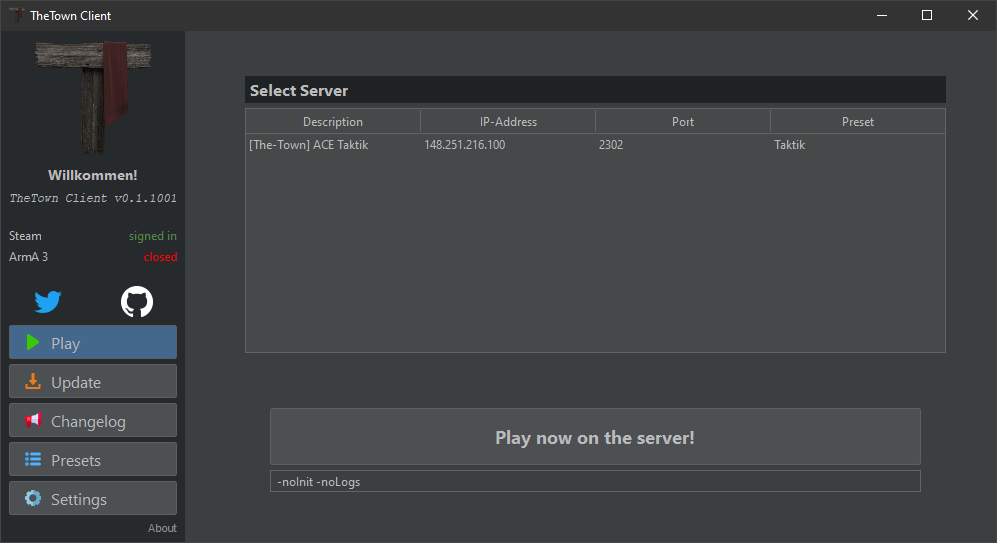
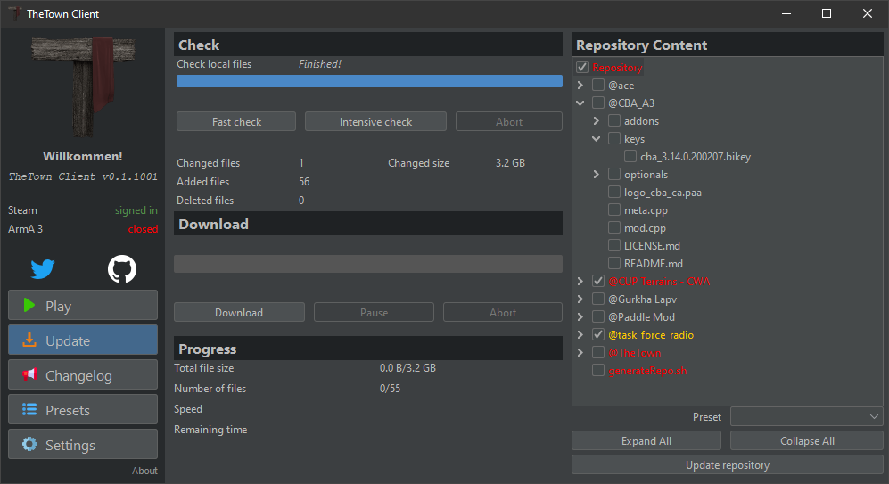
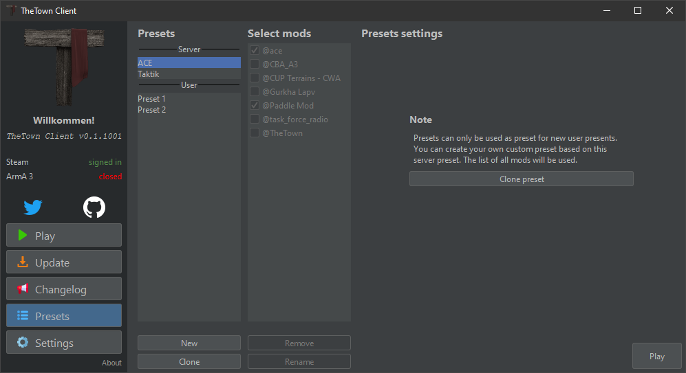
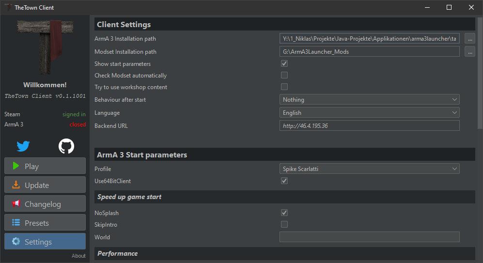

# Custom ArmA 3 Launcher
[](https://giteaci.mc8051.de/Gurkengewuerz/arma3launcher) [Artifacts](https://artifacts.mc8051.de/Gurkengewuerz/arma3launcher)

This is the official launcher/download-client of <a href="https://the-town.net/" target="_blank">the-town.net</a>.  

This launcher uses a differential download method called <a href="http://zsync.moria.org.uk/" target="_blank">zsync</a>.
This means that only changes between any old versions of the files on the computer and the files provided online are downloaded.

> An optimised client-side implementation of the rsync algorithm. It allows updating of files from a remote web server, with efficiency approaching that of rsync -z, without requiring a special remote server application.


### Configure
If you want to use our launcher for your project, **please change the icons**!
Open ``gui/src/main/resources/arma3launcher.json`` and edit the variables as you need.
To configure your logo replace the _logo\*_ files inside the ``gui/src/main/resources/icons/`` folder.

### Build
To build this project you need JDK12+ and maven.  
To compile a single module run
```bash
mvn package -pl {gui/patcher}
```

To compile the project for distribution you a bundled JRE in ``dist/src/main/resources/jre.zip``.
A bundled JRE should be an OpenJDK with the following folder structure:

```
jre.zip
└── jre
    ├── bin
    ├── conf
    ├── include
    ├── jmods
    ├── legal
    ├── lib
    └── release
```

After that run
```bash
mvn package
```

After building the project for distribution you find the universal auto patcher inside ``patcher/target/patcher.jar``.
Inside ``gui/target/`` you find the gui as jar and jar with dependencies.
The jar wrapper build with <a href="https://github.com/libgdx/packr/" target="_blank">packr</a> can be found as an assembled zip file
inside the ``dis/target/`` folder.

### Distribute
After building the package you find inside the ``dist/target/`` folder an zip file.
This zip file contains the bundled ``jre/`` folder and an empty ``logs/`` folder.  

**Please note that the .exe does not have an icon!!**  
I tried [*rcedit*](https://github.com/electron/rcedit) to edit the resource icon in assembly but many anti virus scanner flag the wrapper than an false positive!

Linux/Mac users can run the *arma3launcher-gui.jar*.  
Windows users can simply run the *arma3launcher.exe* and the packr wrapper prioritize the local JRE else use the bundled jre. 

### Server side setup
For the server side you need a simple webserver with no special configuration.

The server side setup/configuration is done inside the ``<webserver root>/.sync/`` folder.
Upload the files from ``linux/.sync/`` to ``<webserver root>/.sync/``.
#### generateRepo.sh
The *generateRepo.sh* is very important to run after every update of mods.
Add new mods simply to ``<webserver root>``.

You should generate the repository locally and update the changes via rsync.
On Windows choose mingw or the linux subsystem.
````bash
rsync -a --exclude 'generateRepo.sh*' ./ remote_user@remote_host_or_ip:<webserver root>
````
#### modset.json
The *modset.json* file is generated automatically by running the generateRepo.sh.
It is containing the folder structure as well as the file sizes and sha1 sums. 

#### server.json
The *server.json* file contains all server as well as the modsets.
The modsets are simply strings that should equal the corresponding folder.  
Please see the example file.

### changelog.txt
The *changelog.txt* is a plain text file to write your changelogs for the modpacks, client or what ever.  
The file is caches for 5 minutes and only loaded if the user switches the tab to the changelog tab.

#### version.txt
The *version.txt* is used for the autoupdater. It contains one line:
```
x.x.x:FILE.jar
```

*x.x.x* is the new version. *FILE.jar* is the new file that the client will download inside the ``<webserver root>/.sync/`` folder.

#### patcher.jar
The *patcher.jar* is a universal patcher and should not need to be updated. 
The client download the patcher just once the ``%APDATA%/<launcher name>`` directory and only if a new version is available.
If the *patcher.jar* already exists, the client skips the download.

#### arma3launcher.jar
The *arma3launcher.jar* is only a representation of the *FILE.jar*. See **version.txt**.

## Screenshots
  

  

  

